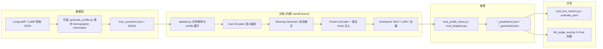
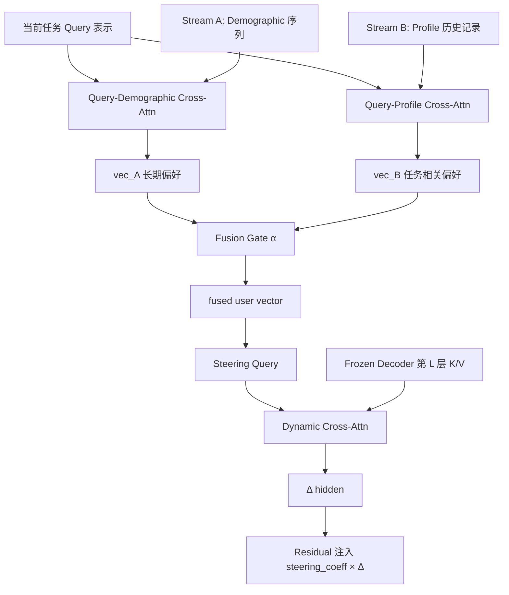
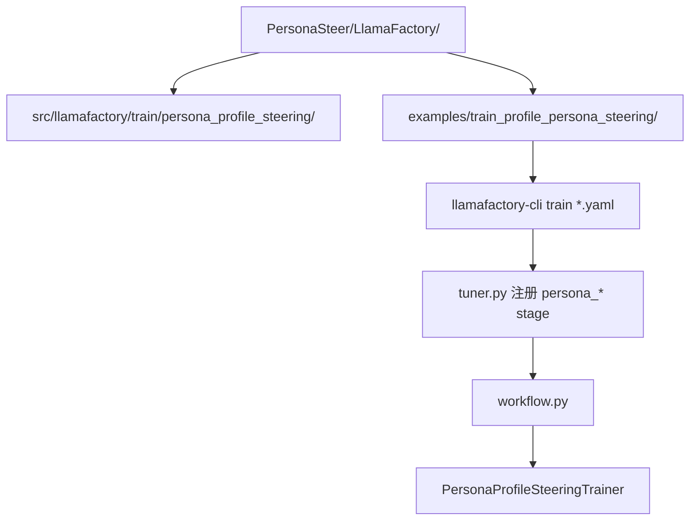
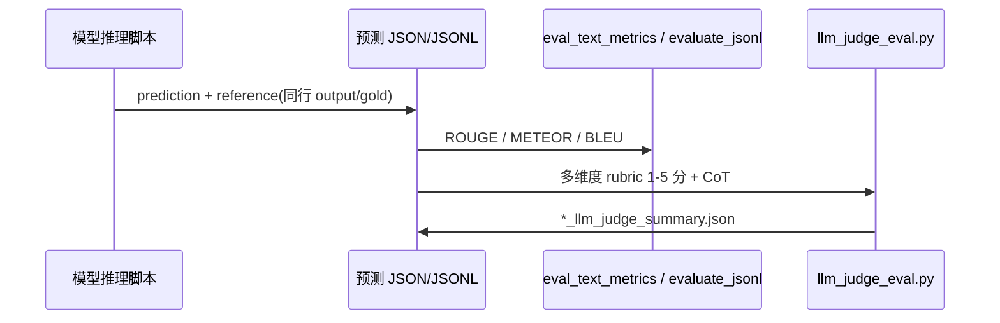

# PersonaSteer 整体架构

PersonaSteer 在**冻结的解码器 LLM** 上，通过可训练的 **User Encoder** 与 **Steering Generator**，将用户画像（人口统计 + 历史行为）映射为**动态 steering 向量**，在指定 Transformer 层注入残差流，实现个性化文本生成。

---

## 1. 端到端数据流

---

## 2. 核心模型：双流 User Encoder + 动态 Steering

| 模块 | 代码位置 | 作用 |
|------|----------|------|
| Stream A | `LlamaFactory/src/llamafactory/train/persona_profile_steering/steering_vector.py` | Query 对人口统计序列做交叉注意力 |
| Stream B | 同上 (`ProfileQueryAttention`) | Query 对 profile 历史做交叉注意力 |
| Fusion | `FusionGate` + `fusion_alpha_min/max` | 自适应混合 A/B，防止塌缩到 0/1 |
| Dynamic steering | `workflow.py` + decoder hooks | fused 向量作 Query， attend 冻结解码器隐状态 |
| User Encoder | `user_encoder_name`（如 Embedding 模型 + LoRA） | 将文本 profile / demographic 编码为向量 |

训练阶段（`use_two_stage_training`）：

1. **Stage 1**（`mlp_only_steps`）：冻结 User Encoder，只训 Steering Generator（门控与 MLP/注意力稳定）。
2. **Stage 2**：解冻 User Encoder（或 LoRA），端到端联合优化。

LlamaFactory `stage` 取值：

- `persona_steering`：单流 / 基础 steering
- `persona_profile_steering`：双流 + profile + fusion（推荐主配置）

---

## 3. 与 LlamaFactory 的集成关系

本仓库自带完整 LlamaFactory 副本，PersonaSteer 训练代码已集成，无需额外 merge。

---

## 4. 目录与职责

| 路径 | 职责 |
|------|------|
| `LlamaFactory/src/llamafactory/train/persona_profile_steering/` | 双流 profile steering（主路径） |
| `LlamaFactory/src/llamafactory/train/persona_steering/` | 单流 steering |
| `LlamaFactory/examples/train_profile_persona_steering/` | 训练 YAML + `run_dual_stream_train.sh` |
| `Datasets/` | `generate_profile.py` / `generate_profile.sh` 填充 demographic |
| `Eval/eval_profile_steer.py` | 主评测：checkpoint 生成 + 自动指标 |
| `Eval/eval_longlamp.py` | LongLaMP 评测（需 LongLaMP-Benchmark 的 `data/`、`prompts/`） |
| `Eval/eval_text_metrics.py` | ROUGE / METEOR 等指标库 |
| `Eval/llm_judge_eval.py` | LLM-as-Judge（`OPENAI_API_KEY`） |
| `scripts/` | 端到端薄封装脚本 |
| `download.py` | 从 Hugging Face 拉取公开评测结果 |

---

## 5. 评测流水线

- **自动指标**：预测文件需含 `prediction`（或等价字段）与**同行** `output`/`gold` 作 reference。
- **LLM Judge**：通过环境变量 `OPENAI_API_KEY`、`OPENAI_BASE_URL` 配置；支持目录批量、`--coeff_min/max` 过滤 steering 系数目录。

---

## 6. 支持的任务

| `task` | 基准 | Profile 典型字段 |
|--------|------|------------------|
| `generation_abstract` | LongLaMP | `title`, `abstract` |
| `topic_writing` | LongLaMP | `input`/`output` 或 `summary`/`content` |
| `product_review_writing` | LongLaMP | `overall`, `summary`, `description`, `reviewText` |
| `lamp_4` | LaMP-4 | `title`, `text` |
| `lamp_5` | LaMP-5 | `title`, `abstract` |
| `lamp_7` | LaMP-7 | `text`, `date`, `id` |

任务由数据路径或 YAML 中 `task` 字段推断；字段说明见 README「Supported tasks」与 `persona_profile_steering/dataset.py`。

---

## 7. 典型工作流（简表）

1. 下载 LongLaMP / LaMP 数据 → 可选 `Datasets/generate_profile.py` 填充 demographic。
2. 编辑 `LlamaFactory/examples/train_profile_persona_steering/custom_persona_steering.yaml`。
3. `cd LlamaFactory && llamafactory-cli train ...` 两阶段训练。
4. `Eval/eval_profile_steer.py` 生成预测并算自动指标。
5. `Eval/llm_judge_eval.py` 做 LLM Judge（可选）。

更细的安装与命令示例见 [README_en.md](README_en.md)。
